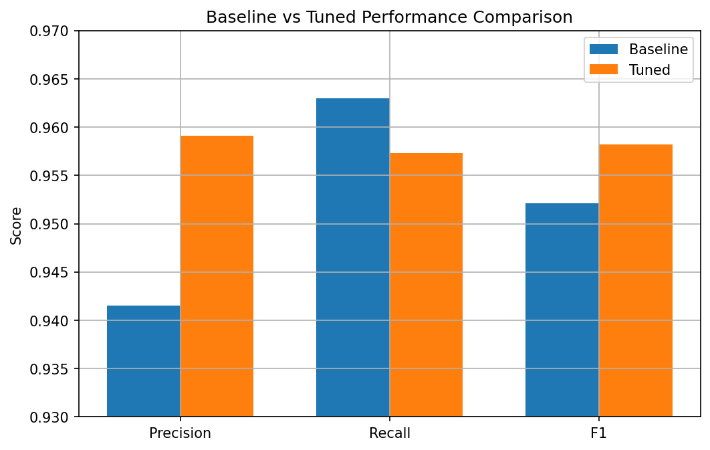

# Face Detection Optimization with YOLOv8

This project analyzes and optimizes the inference performance of a YOLOv8-based face detection model on the FDDB dataset.  
The main goal is to improve detection quality by tuning inference-time parameters without retraining the model.

---

##  Project Overview

In this study, we perform a detailed analysis of:

- Confidence threshold sweep  
- Precision / Recall / F1-score trade-offs  
- FPPI (False Positives Per Image) & Miss Rate analysis  
- NMS IoU threshold optimization  
- Final baseline vs tuned model comparison  

All experiments are conducted on the validation split of the FDDB dataset using a pretrained YOLOv8 model.

---

##  Methodology

### 1. Baseline Model
- Model: YOLOv8 (Ultralytics)
- Default inference parameters:
  - Confidence = 0.25  
  - NMS IoU = 0.50  

Baseline performance is evaluated using custom FP / FN / TP analysis.

---

### 2. Confidence Threshold Sweep

We evaluate multiple confidence thresholds:

[0.10, 0.15, 0.20, 0.25, 0.30, 0.35, 0.40, 0.50]

Metrics computed for each threshold:

- Precision  
- Recall  
- F1-score  
- FPPI  
- Miss Rate  

This allows us to identify the best operating point that balances false positives and missed detections.

---

### 3. NMS IoU Optimization

We analyze the effect of different NMS IoU thresholds:

[0.30, 0.40, 0.50, 0.60, 0.70]

Observations:

- Recall remains almost constant → model already detects most faces  
- Precision decreases for higher IoU thresholds due to excessive suppression  
- Best trade-off observed around **IoU = 0.30**

---

### 4. Final Tuned Configuration

Best performing configuration:

- Confidence = **0.40**  
- NMS IoU = **0.30**

This setting improves overall F1-score and reduces false positives compared to the baseline.

---

## Final Results

| Setting | Precision | Recall | F1-score |
|--------|-----------|--------|----------|
| Baseline (conf=0.25, iou=0.50) | ~0.94 | ~0.96 | ~0.95 |
| Tuned (conf=0.40, iou=0.30) | ~0.96 | ~0.96 | ~0.96 |

The tuned configuration achieves a better balance between precision and recall and increases the final F1-score.

---

## Key Takeaways

- Inference-time optimization can significantly improve model performance without retraining  
- Confidence threshold tuning provides the largest gain  
- NMS IoU should be carefully selected to avoid over-suppression  
- The final tuned model achieves a more stable and balanced detection behavior  

---

## Technologies Used

- Python  
- Ultralytics YOLOv8  
- NumPy, Pandas  
- Matplotlib  
- FDDB Face Detection Dataset  

---

## Author

Sude Soylemez  
Face Detection Optimization Project – 2026

## 📈 Performance Curves

### Precision / Recall / F1 vs Confidence

### FPPI & Miss Rate vs Confidence

### Effect of NMS IoU on Performance

### Baseline vs Tuned Comparison

